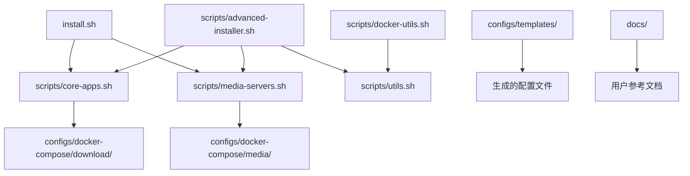

# PT Docker Installer 完整文件列表

## 📁 项目文件结构

```
pt-docker-installer/
├── 📄 README.md                           # 项目主说明文档
├── 📄 LICENSE                             # MIT开源许可证
├── 📄 CHANGELOG.md                        # 更新日志
├── 📄 FAQ.md                              # 常见问题解答
├── 📄 PROJECT_STRUCTURE.md                # 项目结构说明
├── 📄 PROJECT_FILES_LIST.md               # 完整文件列表(本文件)
├── 📄 version.txt                         # 版本信息
├── 🔧 install.sh                          # 主安装脚本(v1.0)
│
├── 📁 scripts/                            # 脚本目录
│   ├── 🔧 advanced-installer.sh          # 高级安装脚本(v2.0)
│   ├── 🔧 core-apps.sh                   # 核心应用安装脚本
│   ├── 🔧 media-servers.sh               # 媒体服务器配置脚本
│   ├── 🔧 docker-utils.sh                # Docker工具脚本
│   └── 🔧 utils.sh                       # 通用工具函数库
│
├── 📁 configs/                            # 配置文件目录
│   ├── 📄 docker-compose-templates.yml   # 完整应用配置模板
│   ├── 📁 docker-compose/                # 分类配置目录
│   │   ├── 📁 download/                   # 下载工具配置
│   │   │   ├── 📄 qbittorrent.yml
│   │   │   └── 📄 transmission.yml
│   │   ├── 📁 automation/                 # 自动化工具配置
│   │   │   └── 📄 moviepilot.yml
│   │   └── 📁 media/                      # 媒体服务器配置
│   │       ├── 📄 emby.yml
│   │       ├── 📄 jellyfin.yml
│   │       └── 📄 plex.yml
│   └── 📁 templates/                      # 配置模板目录
│       ├── 📄 nginx.conf.template         # Nginx配置模板
│       ├── 📄 qbittorrent.conf.template  # qBittorrent配置模板
│       └── 📄 environment.env.template   # 环境变量模板
│
└── 📁 docs/                               # 文档目录
    ├── 📄 installation.md                 # 详细安装指南
    └── 📄 configuration.md                # 配置指南
```

## 📝 文件功能说明

### 🔧 核心脚本文件

| 文件名 | 功能描述 | 使用场景 |
|--------|----------|----------|
| `install.sh` | 主安装脚本，v1.0基础版 | 新手用户，一键安装核心套件 |
| `scripts/advanced-installer.sh` | 高级安装脚本，v2.0预览版 | 进阶用户，分类选择多种应用 |
| `scripts/core-apps.sh` | 核心应用安装脚本 | 专门安装PT必备的4个核心应用 |
| `scripts/media-servers.sh` | 媒体服务器配置脚本 | 配置Emby/Jellyfin/Plex等媒体服务器 |
| `scripts/docker-utils.sh` | Docker工具脚本 | 日常维护、监控、备份等操作 |
| `scripts/utils.sh` | 通用工具函数库 | 提供各种工具函数供其他脚本调用 |

### 📄 文档文件

| 文件名 | 内容描述 | 目标读者 |
|--------|----------|----------|
| `README.md` | 项目主文档，包含快速开始指南 | 所有用户 |
| `LICENSE` | MIT开源许可证 | 开发者和贡献者 |
| `CHANGELOG.md` | 版本更新日志 | 关注项目更新的用户 |
| `FAQ.md` | 常见问题解答 | 遇到问题的用户 |
| `PROJECT_STRUCTURE.md` | 项目结构详细说明 | 开发者和贡献者 |
| `docs/installation.md` | 详细安装指南 | 新手用户 |
| `docs/configuration.md` | 详细配置指南 | 进阶用户 |

### ⚙️ 配置文件

| 文件名 | 配置内容 | 用途 |
|--------|----------|------|
| `configs/docker-compose-templates.yml` | 完整的Docker Compose模板 | 包含所有支持应用的配置 |
| `configs/docker-compose/download/*.yml` | 下载工具单独配置 | qBittorrent、Transmission等 |
| `configs/docker-compose/automation/*.yml` | 自动化工具单独配置 | MoviePilot、Sonarr等 |
| `configs/docker-compose/media/*.yml` | 媒体服务器单独配置 | Emby、Jellyfin、Plex等 |
| `configs/templates/nginx.conf.template` | Nginx反向代理配置模板 | 统一访问入口和HTTPS支持 |
| `configs/templates/qbittorrent.conf.template` | qBittorrent配置模板 | 自动优化qBittorrent设置 |
| `configs/templates/environment.env.template` | 环境变量配置模板 | 统一管理所有配置参数 |

## 🚀 使用流程

### 1️⃣ 新手用户 (推荐)
```bash
# 下载主安装脚本
wget https://raw.githubusercontent.com/everett7623/pt-docker-installer/main/install.sh

# 运行安装
sudo bash install.sh
```

### 2️⃣ 进阶用户
```bash
# 克隆完整项目
git clone https://github.com/everett7623/pt-docker-installer.git
cd pt-docker-installer

# 运行高级安装脚本
sudo bash scripts/advanced-installer.sh
```

### 3️⃣ 定制用户
```bash
# 使用单独的脚本文件
sudo bash scripts/core-apps.sh install /opt/docker /opt/downloads
sudo bash scripts/media-servers.sh interactive /opt/docker /opt/downloads
sudo bash scripts/docker-utils.sh status
```

## 📋 文件依赖关系



## 🔄 版本对应关系

| 版本 | 主要文件 | 功能特性 |
|------|----------|----------|
| v1.0 | `install.sh` | 基础安装，核心4应用 |
| v1.1 | `install.sh` + `scripts/utils.sh` | 增强错误处理和日志 |
| v2.0 | `scripts/advanced-installer.sh` | 分类选择，50+应用支持 |
| v2.1 | 全部文件 | 完整功能，NAS支持 |

## 📦 打包发布清单

### 基础发布包 (v1.0)
```
pt-docker-installer-v1.0/
├── README.md
├── LICENSE
├── install.sh
└── version.txt
```

### 完整发布包 (v2.0+)
```
pt-docker-installer-v2.0/
├── 所有文件 (完整目录结构)
```

## 🛠️ 开发者说明

### 修改文件时的注意事项
1. **脚本文件**: 修改后需要测试所有支持的系统
2. **配置模板**: 变量名要与脚本中的保持一致
3. **文档文件**: 更新后要同步更新其他相关文档
4. **版本文件**: 每次发布前要更新version.txt

### 新增应用的文件修改清单
1. `scripts/advanced-installer.sh` - 添加应用定义和配置函数
2. `configs/docker-compose-templates.yml` - 添加完整配置
3. `configs/docker-compose/{category}/new-app.yml` - 创建独立配置文件
4. `README.md` - 更新支持应用列表
5. `docs/configuration.md` - 添加配置说明
6. `CHANGELOG.md` - 记录更新内容

### 测试文件清单
```bash
# 必须测试的脚本
./install.sh
./scripts/advanced-installer.sh
./scripts/core-apps.sh install /tmp/test /tmp/downloads  
./scripts/media-servers.sh interactive /tmp/test /tmp/downloads
./scripts/docker-utils.sh status
./scripts/utils.sh test-system
```

## 📊 文件统计信息

| 类型 | 数量 | 总行数 | 描述 |
|------|------|--------|------|
| Shell脚本 | 6个 | ~3000行 | 核心功能实现 |
| YAML配置 | 8个 | ~800行 | Docker Compose配置 |
| 模板文件 | 3个 | ~500行 | 配置文件模板 |
| 文档文件 | 8个 | ~2000行 | 用户指南和说明 |
| **总计** | **25个** | **~6300行** | **完整项目** |

## 🎯 文件优先级

### 🔥 必需文件 (核心功能)
- `README.md` - 项目入口文档
- `LICENSE` - 开源许可证
- `install.sh` - 主安装脚本
- `version.txt` - 版本标识

### ⭐ 重要文件 (增强功能)
- `scripts/advanced-installer.sh` - 高级安装
- `scripts/core-apps.sh` - 核心应用
- `scripts/docker-utils.sh` - 工具脚本
- `configs/docker-compose-templates.yml` - 配置模板

### 📚 辅助文件 (完善体验)
- `FAQ.md` - 问题解答
- `CHANGELOG.md` - 更新日志
- `docs/` - 详细文档
- `configs/templates/` - 配置模板

## 🔍 文件内容验证清单

### Shell脚本验证
```bash
# 语法检查
shellcheck *.sh scripts/*.sh

# 权限检查
find . -name "*.sh" -exec chmod +x {} \;

# 执行测试
bash -n install.sh  # 语法验证
```

### YAML文件验证
```bash
# Docker Compose语法检查
docker-compose -f configs/docker-compose-templates.yml config

# 分类配置检查
for file in configs/docker-compose/*/*.yml; do
    docker-compose -f "$file" config >/dev/null && echo "✅ $file" || echo "❌ $file"
done
```

### 文档文件验证
```bash
# Markdown语法检查 (如果有markdownlint)
markdownlint *.md docs/*.md

# 链接检查
grep -r "http" *.md docs/*.md | grep -v "localhost"
```

## 📋 发布前检查清单

- [ ] 所有脚本文件可执行权限正确
- [ ] 版本号在version.txt中已更新
- [ ] CHANGELOG.md已记录本版本更新内容
- [ ] README.md中的功能列表已同步更新
- [ ] 所有YAML配置文件语法正确
- [ ] 文档中的链接和引用正确
- [ ] 测试脚本在主要系统上运行正常
- [ ] 项目结构图和文件列表已更新

## 💡 使用建议

### 对于用户
1. **新手**: 直接使用`install.sh`
2. **进阶**: 使用`scripts/advanced-installer.sh`
3. **专家**: 组合使用各individual脚本

### 对于开发者  
1. **贡献代码**: 先阅读`PROJECT_STRUCTURE.md`
2. **添加应用**: 按照上述文件修改清单操作
3. **测试验证**: 使用文件内容验证清单

### 对于维护者
1. **定期更新**: Docker镜像版本、文档内容
2. **监控反馈**: GitHub Issues、用户反馈
3. **版本发布**: 遵循语义化版本规范

---

📧 **项目地址**: https://github.com/everett7623/pt-docker-installer

⭐ **如果这个项目对你有帮助，请给我们一个Star！**
